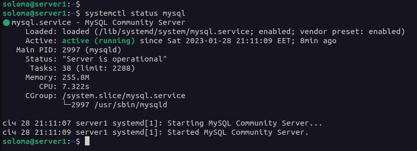
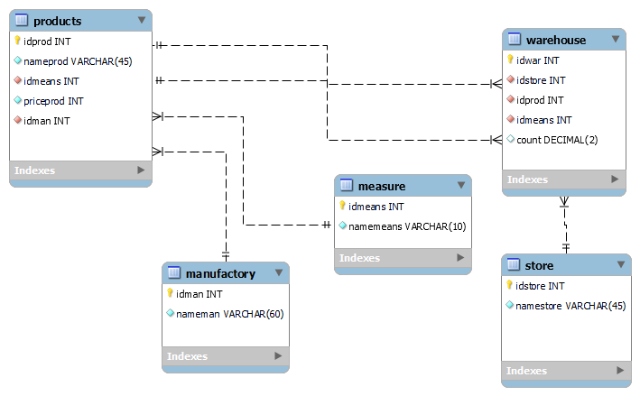
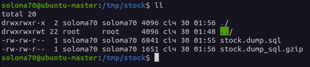
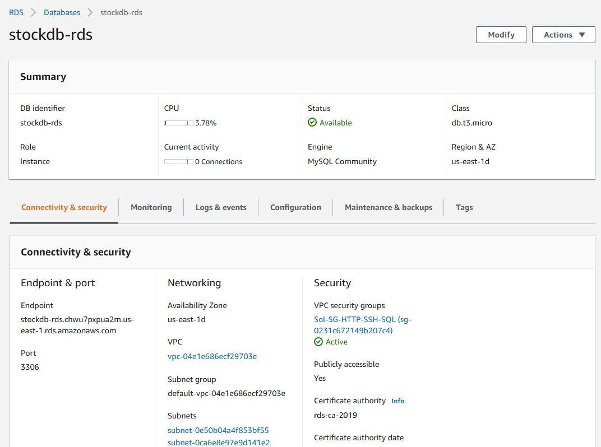
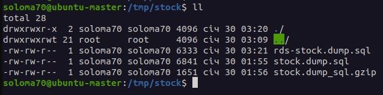

# Database Administration. Task DB1.

## Part 1.
### Step 1. Download and install MySQL server for Linux Ubuntu.
```
sudo apt install mysql-server
systemctl status mysql
```


### Step 2. Database schema *stock*.


### Step 3. Create database *stock*.
```
mysql -u root -p
> CREATE DATABASE stock;
> USE stock;
> CREATE TABLE store (
  idstore INT NOT NULL AUTO_INCREMENT,
  namestore VARCHAR(45) NOT NULL,
  PRIMARY KEY (idstore)
  );
> CREATE TABLE measure (
  idmeans INT NOT NULL AUTO_INCREMENT,
  namemeans VARCHAR(10) NOT NULL,
  PRIMARY KEY (idmeans)
  );
> CREATE TABLE manufactory (
  idman INT NOT NULL AUTO_INCREMENT,
  nameman VARCHAR(60) NOT NULL,
  PRIMARY KEY (`idman`)
  );
> CREATE TABLE products (
  idprod INT NOT NULL AUTO_INCREMENT,
  nameprod VARCHAR(45) NOT NULL,
  idmeans INT NOT NULL,
  priceprod DECIMAL(8,2) NOT NULL,
  idman INT NOT NULL,
  PRIMARY KEY (idprod),
  CONSTRAINT idmeans
    FOREIGN KEY (idmeans)
    REFERENCES measure (idmeans),
  CONSTRAINT idman
    FOREIGN KEY (idman)
    REFERENCES manufactory (idman)
  );
> CREATE TABLE warehouse (
  idwar INT NOT NULL AUTO_INCREMENT,
  idstore INT NOT NULL,
  idprod INT NOT NULL,
  count DECIMAL(8,2) NOT NULL,
  PRIMARY KEY (idwar),
  CONSTRAINT idstore
    FOREIGN KEY (idstore)
    REFERENCES store (idstore),
  CONSTRAINT idprod
    FOREIGN KEY (idprod)
    REFERENCES products (idprod)
  );
> SHOW TABLES;
+-----------------+
| Tables_in_stock |
+-----------------+
| manufactory     |
| measure         |
| products        |
| store           |
| warehouse       |
+-----------------+
5 rows in set (0,00 sec)

```

### Step 4. Filling tables.
```
> INSERT INTO store (namestore) values 
  ('Gagarina'),
  ('Barabashova'),
  ('Nauki'),
  ('Peremogi'),
  ('Valentynivska'),
  ('Nikolsky');
> SELECT * FROM store;
+---------+---------------+
| idstore | namestore     |
+---------+---------------+
|       1 | Gagarina      |
|       2 | Barabashova   |
|       3 | Nauki         |
|       4 | Peremogi      |
|       5 | Valentynivska |
|       6 | Nikolsky      |
+---------+---------------+
6 rows in set (0,00 sec)

> INSERT INTO measure (namemeans) values 
  ('kilograms'),
  ('liters'),
  ('pieces'),
  ('meters');
> SELECT * FROM measure;
+---------+-----------+
| idmeans | namemeans |
+---------+-----------+
|       1 | kilograms |
|       2 | liters    |
|       3 | pieces    |
|       4 | meters    |
+---------+-----------+
4 rows in set (0,00 sec)

> INSERT INTO manufactory (nameman) values 
  ('Ukraine'),
  ('Turkey'),
  ('Poland'),
  ('China'),
  ('USA'),
  ('Germany');
> SELECT * FROM manufactory;
+-------+---------+
| idman | nameman |
+-------+---------+
|     1 | Ukraine |
|     2 | Turkey  |
|     3 | Poland  |
|     4 | China   |
|     5 | USA     |
|     6 | Germany |
+-------+---------+
6 rows in set (0,00 sec)

>INSERT INTO products (nameprod, idmeans, priceprod, idman) values 
  ('Orange', 1, 45.50, 2),
  ('Banana', 1, 50.25, 5),
  ('Garlic', 1, 96.80, 4),
  ('Onion', 1, 18.45, 1),
  ('Tomato', 1, 60.00, 2),
  ('Soy Sause', 2, 126.34, 3),
  ('Hot Dogs', 3, 80.20, 6);
> SELECT * FROM products;
+--------+-----------+---------+-----------+-------+
| idprod | nameprod  | idmeans | priceprod | idman |
+--------+-----------+---------+-----------+-------+
|      1 | Orange    |       1 |     45.50 |     2 |
|      2 | Banana    |       1 |     50.25 |     5 |
|      3 | Garlic    |       1 |     96.80 |     4 |
|      4 | Onion     |       1 |     18.45 |     1 |
|      5 | Tomato    |       1 |     60.00 |     2 |
|      6 | Soy Sause |       2 |    126.34 |     3 |
|      7 | Hot Dogs  |       3 |     80.20 |     6 |
+--------+-----------+---------+-----------+-------+
7 rows in set (0,00 sec)

>INSERT INTO warehouse (idstore, idprod, count) values 
  (1, 1, 126.15),
  (3, 2, 224.10),
  (1, 4, 15.00),
  (4, 7, 411.00),
  (6, 5, 314.00),
  (6, 6, 15.00),
  (4, 6, 21.00),
  (1, 6, 10.00),
  (2, 7, 125.00),
  (3, 7, 51.00),
  (2, 3, 12.45),
  (2, 4, 26.10);
> SELECT * FROM warehouse;
+-------+---------+--------+--------+
| idwar | idstore | idprod | count  |
+-------+---------+--------+--------+
|     1 |       1 |      1 | 126.15 |
|     2 |       3 |      2 | 224.10 |
|     3 |       1 |      4 |  15.00 |
|     4 |       4 |      7 | 411.00 |
|     5 |       6 |      5 | 314.00 |
|     6 |       6 |      6 |  15.00 |
|     7 |       4 |      6 |  21.00 |
|     8 |       1 |      6 |  10.00 |
|     9 |       2 |      7 | 125.00 |
|    10 |       3 |      7 |  51.00 |
|    11 |       2 |      3 |  12.45 |
|    12 |       2 |      4 |  26.10 |
+-------+---------+--------+--------+
12 rows in set (0,00 sec)
```

## Step 5. SELECT operator with WHERE, GROUP BY and ORDER BY.
```
> SELECT namestore, nameprod, nameman, priceprod, count, namemeans 
  FROM store, products, manufactory, warehouse, measure 
  WHERE warehouse.idprod = products.idprod AND warehouse.idstore = store.idstore 
  AND products.idman = manufactory.idman AND products.idmeans = measure.idmeans;
+-------------+-----------+---------+-----------+--------+-----------+
| namestore   | nameprod  | nameman | priceprod | count  | namemeans |
+-------------+-----------+---------+-----------+--------+-----------+
| Gagarina    | Orange    | Turkey  |     45.50 | 126.15 | kilograms |
| Gagarina    | Onion     | Ukraine |     18.45 |  15.00 | kilograms |
| Gagarina    | Soy Sause | Poland  |    126.34 |  10.00 | liters    |
| Barabashova | Hot Dogs  | Germany |     80.20 | 125.00 | pieces    |
| Barabashova | Garlic    | China   |     96.80 |  12.45 | kilograms |
| Barabashova | Onion     | Ukraine |     18.45 |  26.10 | kilograms |
| Nauki       | Banana    | USA     |     50.25 | 224.10 | kilograms |
| Nauki       | Hot Dogs  | Germany |     80.20 |  51.00 | pieces    |
| Peremogi    | Hot Dogs  | Germany |     80.20 | 411.00 | pieces    |
| Peremogi    | Soy Sause | Poland  |    126.34 |  21.00 | liters    |
| Nikolsky    | Tomato    | Turkey  |     60.00 | 314.00 | kilograms |
| Nikolsky    | Soy Sause | Poland  |    126.34 |  15.00 | liters    |
+-------------+-----------+---------+-----------+--------+-----------+
12 rows in set (0,00 sec)

> SELECT namestore, nameprod, nameman, priceprod, count, namemeans, (priceprod*count) AS sum 
  FROM store, products, manufactory, warehouse, measure 
  WHERE warehouse.idprod = products.idprod AND warehouse.idstore = store.idstore 
  AND products.idman = manufactory.idman AND products.idmeans = measure.idmeans 
  AND priceprod > 50 
  ORDER BY nameprod;
+-------------+-----------+---------+-----------+--------+-----------+------------+
| namestore   | nameprod  | nameman | priceprod | count  | namemeans | sum        |
+-------------+-----------+---------+-----------+--------+-----------+------------+
| Nauki       | Banana    | USA     |     50.25 | 224.10 | kilograms | 11261.0250 |
| Barabashova | Garlic    | China   |     96.80 |  12.45 | kilograms |  1205.1600 |
| Peremogi    | Hot Dogs  | Germany |     80.20 | 411.00 | pieces    | 32962.2000 |
| Barabashova | Hot Dogs  | Germany |     80.20 | 125.00 | pieces    | 10025.0000 |
| Nauki       | Hot Dogs  | Germany |     80.20 |  51.00 | pieces    |  4090.2000 |
| Nikolsky    | Soy Sause | Poland  |    126.34 |  15.00 | liters    |  1895.1000 |
| Peremogi    | Soy Sause | Poland  |    126.34 |  21.00 | liters    |  2653.1400 |
| Gagarina    | Soy Sause | Poland  |    126.34 |  10.00 | liters    |  1263.4000 |
| Nikolsky    | Tomato    | Turkey  |     60.00 | 314.00 | kilograms | 18840.0000 |
+-------------+-----------+---------+-----------+--------+-----------+------------+
9 rows in set (0,00 sec)

*Attention! This exampe do after UPDATE in the p1s6a*
> SELECT addrstore AS sity, count(*) AS count_store FROM store 
  GROUP BY addrstore 
  ORDER BY addrstore;
+----------+-------------+
| sity     | count_store |
+----------+-------------+
| Kharkiv  |           4 |
| Kupjansk |           1 |
| Lozova   |           1 |
| Zmiiv    |           1 |
+----------+-------------+
4 rows in set (0,00 sec)
```

## Step 6. Execute other different SQL queries DDL, DML, DCL.
### a) DDL - CREATE (p1s3), ALTER, DROP, TRUNCATE, RENAME, COMMENT.
```
> ALTER TABLE store ADD COLUMN addrstore VARCHAR(50) AFTER namestore;
> ALTER TABLE store ADD COLUMN phone VARCHAR(12) AFTER namestore;
> ALTER TABLE store ADD COLUMN country VARCHAR(20) AFTER namestore;

> SELECT * FROM store;
+---------+---------------+---------+--------------+-----------+
| idstore | namestore     | country | phone        | addrstore |
+---------+---------------+---------+--------------+-----------+
|       1 | Gagarina      | NULL    | 380661234567 | Kharkiv   |
|       2 | Barabashova   | NULL    | 380638451233 | Kharkiv   |
|       3 | Nauki         | NULL    | 380674567812 | Kupjansk  |
|       4 | Peremogi      | NULL    | 380934551616 | Zmiiv     |
|       5 | Valentynivska | NULL    | 380971114545 | Lozova    |
|       6 | Nikolsky      | NULL    | 380505001111 | Kharkiv   |
+---------+---------------+---------+--------------+-----------+
6 rows in set (0,00 sec)
> ALTER TABLE store DROP COLUMN country;
> SELECT * FROM store;
+---------+---------------+--------------+-----------+
| idstore | namestore     | phone        | addrstore |
+---------+---------------+--------------+-----------+
|       1 | Gagarina      | 380661234567 | Kharkiv   |
|       2 | Barabashova   | 380638451233 | Kharkiv   |
|       3 | Nauki         | 380674567812 | Kupjansk  |
|       4 | Peremogi      | 380934551616 | Zmiiv     |
|       5 | Valentynivska | 380971114545 | Lozova    |
|       6 | Nikolsky      | 380505001111 | Kharkiv   |
+---------+---------------+--------------+-----------+
6 rows in set (0,00 sec)

> CREATE TABLE manufactory1 (
  idman INT NOT NULL AUTO_INCREMENT,
  nameman VARCHAR(60) NOT NULL,
  PRIMARY KEY (`idman`)
  );
> INSERT INTO manufactory1 (nameman) values 
  ('Ukraine'),
  ('Turkey'),
  ('Poland'),
  ('China'),
  ('USA'),
  ('Germany');
> RENAME TABLE manufactory1 TO country_man;
> SHOW TABLES;
+-----------------+
| Tables_in_stock |
+-----------------+
| country_man     |
| manufactory     |
| measure         |
| products        |
| store           |
| warehouse       |
+-----------------+
6 rows in set (0,00 sec)
> SELECT * FROM country_man;
+-------+---------+
| idman | nameman |
+-------+---------+
|     1 | Ukraine |
|     2 | Turkey  |
|     3 | Poland  |
|     4 | China   |
|     5 | USA     |
|     6 | Germany |
+-------+---------+
6 rows in set (0,01 sec)
> TRUNCATE TABLE country_man;
> SELECT * FROM country_man;
Empty set (0,01 sec)
> DROP TABLE country_man;
> SHOW TABLES;
+-----------------+
| Tables_in_stock |
+-----------------+
| manufactory     |
| measure         |
| products        |
| store           |
| warehouse       |
+-----------------+
5 rows in set (0,00 sec)

> CREATE TABLE manufactory1 (
  idman INT NOT NULL AUTO_INCREMENT,
  nameman VARCHAR(60) NOT NULL,
  PRIMARY KEY (`idman`)
  );
> ALTER TABLE manufactory1 COMMENT 'This table describes the product manufacturers';
> SELECT TABLE_COMMENT from information_schema.TABLES where TABLE_NAME='manufactory1';
+------------------------------------------------+
| TABLE_COMMENT                                  |
+------------------------------------------------+
| This table describes the product manufacturers |
+------------------------------------------------+
1 row in set (0,00 sec)
> DROP TABLE manufactory1;
```

### b) DML - INSERT (p1s4), UPDATE, DELETE, EXPLAIN, LOCK/UNLOCK TABLE.
```
> UPDATE store
  SET phone = '380661234567', addrstore = 'Kharkiv' 
  WHERE idstore = 1;
> UPDATE store
  SET phone = '380638451233', addrstore = 'Kharkiv' 
  WHERE idstore = 2;
> UPDATE store
  SET phone = '380674567812', addrstore = 'Kupjansk' 
  WHERE idstore = 3;
> UPDATE store
  SET phone = '380934551616', addrstore = 'Zmiiv' 
  WHERE idstore = 4;
> UPDATE store
  SET phone = '380971114545', addrstore = 'Lozova' 
  WHERE idstore = 5;
> UPDATE store
  SET phone = '380505001111', addrstore = 'Kharkiv' 
  WHERE idstore = 6;

> INSERT INTO store (namestore, phone, addrstore) values 
  ('Nikolsky', '380505001111', 'Kharkiv');
> SELECT * FROM store;
+---------+---------------+--------------+-----------+
| idstore | namestore     | phone        | addrstore |
+---------+---------------+--------------+-----------+
|       1 | Gagarina      | 380661234567 | Kharkiv   |
|       2 | Barabashova   | 380638451233 | Kharkiv   |
|       3 | Nauki         | 380674567812 | Kupjansk  |
|       4 | Peremogi      | 380934551616 | Zmiiv     |
|       5 | Valentynivska | 380971114545 | Lozova    |
|       6 | Nikolsky      | 380505001111 | Kharkiv   |
|       7 | Nikolsky      | 380505001111 | Kharkiv   |
+---------+---------------+--------------+-----------+
7 rows in set (0,00 sec)
> DELETE FROM store 
  WHERE idstore = 6;
ERROR 1451 (23000): Cannot delete or update a parent row: a foreign key constraint fails (`stock`.`warehouse`, CONSTRAINT `idstore` FOREIGN KEY (`idstore`) REFERENCES `store` (`idstore`))
> DELETE FROM store 
  WHERE idstore = 7;
Query OK, 1 row affected (0,02 sec)
> SELECT * FROM store;
+---------+---------------+--------------+-----------+
| idstore | namestore     | phone        | addrstore |
+---------+---------------+--------------+-----------+
|       1 | Gagarina      | 380661234567 | Kharkiv   |
|       2 | Barabashova   | 380638451233 | Kharkiv   |
|       3 | Nauki         | 380674567812 | Kupjansk  |
|       4 | Peremogi      | 380934551616 | Zmiiv     |
|       5 | Valentynivska | 380971114545 | Lozova    |
|       6 | Nikolsky      | 380505001111 | Kharkiv   |
+---------+---------------+--------------+-----------+
6 rows in set (0,01 sec)

> EXPLAIN SELECT * FROM store;
+----+-------------+-------+------------+------+---------------+------+---------+------+------+----------+-------+
| id | select_type | table | partitions | type | possible_keys | key  | key_len | ref  | rows | filtered | Extra |
+----+-------------+-------+------------+------+---------------+------+---------+------+------+----------+-------+
|  1 | SIMPLE      | store | NULL       | ALL  | NULL          | NULL | NULL    | NULL |    6 |   100.00 | NULL  |
+----+-------------+-------+------------+------+---------------+------+---------+------+------+----------+-------+
1 row in set, 1 warning (0,00 sec)

> LOCK TABLES store READ, measure WRITE;
> SELECT * FROM store WHERE addrstore = 'Kharkiv';
> ALTER TABLE measure ADD COLUMN shot VARCHAR(6) AFTER namemeans;
> UPDATE measure
  SET shot = 'kg.' 
  WHERE idmeans = 1;
> UPDATE measure
  SET shot = 'lt.' 
  WHERE idmeans = 2;
> UPDATE measure
  SET shot = 'pcs.' 
  WHERE idmeans = 3;
> UPDATE measure
  SET shot = 'mt.' 
  WHERE idmeans = 4;
> SELECT * FROM measure;
+---------+-----------+------+
| idmeans | namemeans | shot |
+---------+-----------+------+
|       1 | kilograms | kg.  |
|       2 | liters    | lt.  |
|       3 | pieces    | pcs. |
|       4 | meters    | mt.  |
+---------+-----------+------+
4 rows in set (0,01 sec)
> UNLOCK TABLES;
```

### c) DML - COMMIT, ROLLBACK.
```
> BEGIN;
> SELECT * FROM stock.products WHERE nameprod = 'Tomato';
> UPDATE stock.manufactory SET nameman = 'Brazilia' WHERE idman = 5;
> COMMIT / ROLLBACK;
```

## Step 7.  Create a database of new users with different privileges. GRANT, REVOKE.
```
> SHOW DATABASES;
+--------------------+
| Database           |
+--------------------+
| books              |
| information_schema |
| mysql              |
| performance_schema |
| phpmyadmin         |
| schedule           |
| stock              |
| sys                |
| test1              |
+--------------------+
9 rows in set (0,00 sec)
> SELECT Host, User, Select_priv AS Sel, Insert_priv AS Ins, Update_priv AS Upd, Delete_priv AS Del, 
  Create_priv AS Crt, Drop_priv AS Drp, Reload_priv AS Rld, Shutdown_priv AS Shd, Process_priv AS Prc, 
  File_priv AS Fl, Grant_priv AS GRT, Alter_priv AS Alt  
  from mysql.user;
+-----------+------------------+-----+-----+-----+-----+-----+-----+-----+-----+-----+----+-----+-----+
| Host      | User             | Sel | Ins | Upd | Del | Crt | Drp | Rld | Shd | Prc | Fl | GRT | Alt |
+-----------+------------------+-----+-----+-----+-----+-----+-----+-----+-----+-----+----+-----+-----+
| localhost | debian-sys-maint | Y   | Y   | Y   | Y   | Y   | Y   | Y   | Y   | Y   | Y  | Y   | Y   |
| localhost | mysql.infoschema | Y   | N   | N   | N   | N   | N   | N   | N   | N   | N  | N   | N   |
| localhost | mysql.session    | N   | N   | N   | N   | N   | N   | N   | Y   | N   | N  | N   | N   |
| localhost | mysql.sys        | N   | N   | N   | N   | N   | N   | N   | N   | N   | N  | N   | N   |
| localhost | phpmyadmin       | N   | N   | N   | N   | N   | N   | N   | N   | N   | N  | N   | N   |
| localhost | root             | Y   | Y   | Y   | Y   | Y   | Y   | Y   | Y   | Y   | Y  | Y   | Y   |
| localhost | soloma70         | Y   | Y   | Y   | Y   | Y   | Y   | Y   | Y   | Y   | Y  | Y   | Y   |
+-----------+------------------+-----+-----+-----+-----+-----+-----+-----+-----+-----+----+-----+-----+
7 rows in set (0,00 sec)

> CREATE USER 'soloma'@'localhost' IDENTIFIED BY '12345678';
> CREATE USER  'user1'@'localhost' IDENTIFIED BY '12345678';
> CREATE USER  'user2'@'localhost' IDENTIFIED BY '11111111';
> CREATE USER  'user3'@'localhost' IDENTIFIED BY '11111111';

> GRANT SELECT, INSERT, UPDATE, DELETE, CREATE, ALTER, DROP 
  ON `stock`.* TO 'soloma'@'localhost';
> GRANT SELECT, INSERT, UPDATE, DELETE, CREATE, ALTER, DROP ON 
  *.* TO 'user1'@'localhost';
> GRANT SELECT, INSERT, UPDATE, DELETE, CREATE, ALTER, DROP ON 
  `books`.* TO 'user2'@'localhost';
> GRANT ALL PRIVILEGES ON 
  `books`.* TO 'user3'@'localhost' WITH GRANT OPTION;
> FLUSH PRIVILEGES;

> SELECT Host, User, Select_priv AS Sel, Insert_priv AS Ins, Update_priv AS Upd, Delete_priv AS Del, 
  Create_priv AS Crt, Drop_priv AS Drp, Reload_priv AS Rld, Shutdown_priv AS Shd, Process_priv AS Prc, 
  File_priv AS Fl, Grant_priv AS GRT, Alter_priv AS Alt  
  from mysql.user;
+-----------+------------------+-----+-----+-----+-----+-----+-----+-----+-----+-----+----+-----+-----+
| Host      | User             | Sel | Ins | Upd | Del | Crt | Drp | Rld | Shd | Prc | Fl | GRT | Alt |
+-----------+------------------+-----+-----+-----+-----+-----+-----+-----+-----+-----+----+-----+-----+
| localhost | debian-sys-maint | Y   | Y   | Y   | Y   | Y   | Y   | Y   | Y   | Y   | Y  | Y   | Y   |
| localhost | mysql.infoschema | Y   | N   | N   | N   | N   | N   | N   | N   | N   | N  | N   | N   |
| localhost | mysql.session    | N   | N   | N   | N   | N   | N   | N   | Y   | N   | N  | N   | N   |
| localhost | mysql.sys        | N   | N   | N   | N   | N   | N   | N   | N   | N   | N  | N   | N   |
| localhost | phpmyadmin       | N   | N   | N   | N   | N   | N   | N   | N   | N   | N  | N   | N   |
| localhost | root             | Y   | Y   | Y   | Y   | Y   | Y   | Y   | Y   | Y   | Y  | Y   | Y   |
| localhost | soloma           | N   | N   | N   | N   | N   | N   | N   | N   | N   | N  | N   | N   |
| localhost | soloma70         | Y   | Y   | Y   | Y   | Y   | Y   | Y   | Y   | Y   | Y  | Y   | Y   |
| localhost | user1            | Y   | Y   | Y   | Y   | Y   | Y   | N   | N   | N   | N  | N   | Y   |
| localhost | user2            | N   | N   | N   | N   | N   | N   | N   | N   | N   | N  | N   | N   |
| localhost | user3            | N   | N   | N   | N   | N   | N   | N   | N   | N   | N  | N   | N   |
+-----------+------------------+-----+-----+-----+-----+-----+-----+-----+-----+-----+----+-----+-----+
11 rows in set (0,00 sec)
> EXIT

$ mysql -u soloma -p
> SHOW DATABASES;
+--------------------+
| Database           |
+--------------------+
| information_schema |
| performance_schema |
| stock              |
+--------------------+
3 rows in set (0,00 sec)
> USE stock;
> SHOW TABLES;
+-----------------+
| Tables_in_stock |
+-----------------+
| manufactory     |
| measure         |
| products        |
| store           |
| warehouse       |
+-----------------+
5 rows in set (0,00 sec)
> SELECT namestore, nameprod, nameman, priceprod, count, namemeans, (priceprod*count) AS sum 
  FROM store, products, manufactory, warehouse, measure 
  WHERE warehouse.idprod = products.idprod AND warehouse.idstore = store.idstore 
  AND products.idman = manufactory.idman AND products.idmeans = measure.idmeans 
  ORDER BY nameprod;
+-------------+-----------+---------+-----------+--------+-----------+------------+
| namestore   | nameprod  | nameman | priceprod | count  | namemeans | sum        |
+-------------+-----------+---------+-----------+--------+-----------+------------+
| Nauki       | Banana    | USA     |     50.25 | 224.10 | kilograms | 11261.0250 |
| Barabashova | Garlic    | China   |     96.80 |  12.45 | kilograms |  1205.1600 |
| Peremogi    | Hot Dogs  | Germany |     80.20 | 411.00 | pieces    | 32962.2000 |
| Barabashova | Hot Dogs  | Germany |     80.20 | 125.00 | pieces    | 10025.0000 |
| Nauki       | Hot Dogs  | Germany |     80.20 |  51.00 | pieces    |  4090.2000 |
| Nikolsky    | Soy Sause | Poland  |    126.34 |  15.00 | liters    |  1895.1000 |
| Peremogi    | Soy Sause | Poland  |    126.34 |  21.00 | liters    |  2653.1400 |
| Gagarina    | Soy Sause | Poland  |    126.34 |  10.00 | liters    |  1263.4000 |
| Nikolsky    | Tomato    | Turkey  |     60.00 | 314.00 | kilograms | 18840.0000 |
+-------------+-----------+---------+-----------+--------+-----------+------------+
9 rows in set (0,00 sec)
> SELECT * From books.authors;
ERROR 1142 (42000): SELECT command denied to user 'soloma'@'localhost' for table 'authors'
> EXIT

$ mysql -u user3 -p
> SHOW DATABASES;
+--------------------+
| Database           |
+--------------------+
| books              |
| information_schema |
| performance_schema |
+--------------------+
3 rows in set (0,00 sec)
> SELECT * From books.authors;
+----+----------------+
| id | name           |
+----+----------------+
|  1 | Nakov          |
|  2 | Shotts William |
|  3 | MARKO LUKŠA    |
|  4 | John Arundel   |
+----+----------------+
4 rows in set (0,00 sec)
> SELECT * From stock.store;
ERROR 1142 (42000): SELECT command denied to user 'user3'@'localhost' for table 'store'
> EXIT

$ mysql -u soloma70 -p
> DROP USER 'user3'@'localhost';
> REVOKE CREATE, ALTER, DROP ON *.* FROM 'user1'@'localhost';
> ALTER USER 'user2'@'localhost' IDENTIFIED BY '87654321';
> FLUSH PRIVILEGES;
> SELECT Host, User, Select_priv AS Sel, Insert_priv AS Ins, Update_priv AS Upd, Delete_priv AS Del, 
  Create_priv AS Crt, Drop_priv AS Drp, Reload_priv AS Rld, Shutdown_priv AS Shd, Process_priv AS Prc, 
  File_priv AS Fl, Grant_priv AS GRT, Alter_priv AS Alt  
  from mysql.user;
+-----------+------------------+-----+-----+-----+-----+-----+-----+-----+-----+-----+----+-----+-----+
| Host      | User             | Sel | Ins | Upd | Del | Crt | Drp | Rld | Shd | Prc | Fl | GRT | Alt |
+-----------+------------------+-----+-----+-----+-----+-----+-----+-----+-----+-----+----+-----+-----+
| localhost | debian-sys-maint | Y   | Y   | Y   | Y   | Y   | Y   | Y   | Y   | Y   | Y  | Y   | Y   |
| localhost | mysql.infoschema | Y   | N   | N   | N   | N   | N   | N   | N   | N   | N  | N   | N   |
| localhost | mysql.session    | N   | N   | N   | N   | N   | N   | N   | Y   | N   | N  | N   | N   |
| localhost | mysql.sys        | N   | N   | N   | N   | N   | N   | N   | N   | N   | N  | N   | N   |
| localhost | phpmyadmin       | N   | N   | N   | N   | N   | N   | N   | N   | N   | N  | N   | N   |
| localhost | root             | Y   | Y   | Y   | Y   | Y   | Y   | Y   | Y   | Y   | Y  | Y   | Y   |
| localhost | soloma           | N   | N   | N   | N   | N   | N   | N   | N   | N   | N  | N   | N   |
| localhost | soloma70         | Y   | Y   | Y   | Y   | Y   | Y   | Y   | Y   | Y   | Y  | Y   | Y   |
| localhost | user1            | Y   | Y   | Y   | Y   | N   | N   | N   | N   | N   | N  | N   | N   |
| localhost | user2            | N   | N   | N   | N   | N   | N   | N   | N   | N   | N  | N   | N   |
+-----------+------------------+-----+-----+-----+-----+-----+-----+-----+-----+-----+----+-----+-----+
10 rows in set (0,00 sec)
> SHOW GRANTS FOR 'soloma'@'localhost';
+------------------------------------------------------------------------------------------------+
| Grants for soloma@localhost                                                                    |
+------------------------------------------------------------------------------------------------+
| GRANT USAGE ON *.* TO `soloma`@`localhost`                                                     |
| GRANT SELECT, INSERT, UPDATE, DELETE, CREATE, DROP, ALTER ON `stock`.* TO `soloma`@`localhost` |
+------------------------------------------------------------------------------------------------+
2 rows in set (0,00 sec)
> SHOW GRANTS FOR 'user2'@'localhost';
+-----------------------------------------------------------------------------------------------+
| Grants for user2@localhost                                                                    |
+-----------------------------------------------------------------------------------------------+
| GRANT USAGE ON *.* TO `user2`@`localhost`                                                     |
| GRANT SELECT, INSERT, UPDATE, DELETE, CREATE, DROP, ALTER ON `books`.* TO `user2`@`localhost` |
+-----------------------------------------------------------------------------------------------+
2 rows in set (0,00 sec)
> SELECT * FROM mysql.db;
> SELECT * FROM mysql.tables_priv;
> SELECT * FROM information_schema.user_privileges;
```

## Step 8. Make a selection from the main table DB MySQL.
```
> USE mysql;
> SHOW TABLES;
+------------------------------------------------------+
| Tables_in_mysql                                      |
+------------------------------------------------------+
| columns_priv                                         |
| component                                            |
| db                                                   |
| default_roles                                        |
| engine_cost                                          |
| func                                                 |
| general_log                                          |
| global_grants                                        |
| gtid_executed                                        |
| help_category                                        |
| help_keyword                                         |
| help_relation                                        |
| help_topic                                           |
| innodb_index_stats                                   |
| innodb_table_stats                                   |
| password_history                                     |
| plugin                                               |
| procs_priv                                           |
| proxies_priv                                         |
| replication_asynchronous_connection_failover         |
| replication_asynchronous_connection_failover_managed |
| replication_group_configuration_version              |
| replication_group_member_actions                     |
| role_edges                                           |
| server_cost                                          |
| servers                                              |
| slave_master_info                                    |
| slave_relay_log_info                                 |
| slave_worker_info                                    |
| slow_log                                             |
| tables_priv                                          |
| time_zone                                            |
| time_zone_leap_second                                |
| time_zone_name                                       |
| time_zone_transition                                 |
| time_zone_transition_type                            |
| user                                                 |
+------------------------------------------------------+
37 rows in set (0,00 sec)
> SELECT * FROM db;
> SELECT * FROM db\G;
> SHOW COLUMNS FROM db;
+-----------------------+---------------+------+-----+---------+-------+
| Field                 | Type          | Null | Key | Default | Extra |
+-----------------------+---------------+------+-----+---------+-------+
| Host                  | char(255)     | NO   | PRI |         |       |
| Db                    | char(64)      | NO   | PRI |         |       |
| User                  | char(32)      | NO   | PRI |         |       |
| Select_priv           | enum('N','Y') | NO   |     | N       |       |
| Insert_priv           | enum('N','Y') | NO   |     | N       |       |
| Update_priv           | enum('N','Y') | NO   |     | N       |       |
| Delete_priv           | enum('N','Y') | NO   |     | N       |       |
| Create_priv           | enum('N','Y') | NO   |     | N       |       |
| Drop_priv             | enum('N','Y') | NO   |     | N       |       |
| Grant_priv            | enum('N','Y') | NO   |     | N       |       |
| References_priv       | enum('N','Y') | NO   |     | N       |       |
| Index_priv            | enum('N','Y') | NO   |     | N       |       |
| Alter_priv            | enum('N','Y') | NO   |     | N       |       |
| Create_tmp_table_priv | enum('N','Y') | NO   |     | N       |       |
| Lock_tables_priv      | enum('N','Y') | NO   |     | N       |       |
| Create_view_priv      | enum('N','Y') | NO   |     | N       |       |
| Show_view_priv        | enum('N','Y') | NO   |     | N       |       |
| Create_routine_priv   | enum('N','Y') | NO   |     | N       |       |
| Alter_routine_priv    | enum('N','Y') | NO   |     | N       |       |
| Execute_priv          | enum('N','Y') | NO   |     | N       |       |
| Event_priv            | enum('N','Y') | NO   |     | N       |       |
| Trigger_priv          | enum('N','Y') | NO   |     | N       |       |
+-----------------------+---------------+------+-----+---------+-------+
22 rows in set (0,00 sec)

*See above many requests to the main DB MySQL*
```


## Part 2. Backup and restore database
### Step 1. Backup
```
$ mysqldump -u soloma70 -p stock > /tmp/stock/stock.dump.sql
or
$ mysqldump -u soloma70 -p stock | gzip > /tmp/stock/stock.dump_sql.gzip
```


### Step 2. Restore from backup
```
$ mysql -u soloma70 -p
> TRUNCATE TABLE stock.warehouse;
> SELECT * FROM stock.warehouse;
Empty set (0,00 sec)
> EXIT

$ mysql -u soloma70 -p stock < /tmp/stock/stock.dump.sql
or 
$ gunzip < /tmp/stock/stock.dump_sql.gzip | mysql -u soloma70 -p stock
$ mysql -u soloma70 -p
> SELECT * FROM stock.warehouse;
+-------+---------+--------+--------+
| idwar | idstore | idprod | count  |
+-------+---------+--------+--------+
|     1 |       1 |      1 | 126.15 |
|     2 |       3 |      2 | 224.10 |
|     3 |       1 |      4 |  15.00 |
|     4 |       4 |      7 | 411.00 |
|     5 |       6 |      5 | 314.00 |
|     6 |       6 |      6 |  15.00 |
|     7 |       4 |      6 |  21.00 |
|     8 |       1 |      6 |  10.00 |
|     9 |       2 |      7 | 125.00 |
|    10 |       3 |      7 |  51.00 |
|    11 |       2 |      3 |  12.45 |
|    12 |       2 |      4 |  26.10 |
+-------+---------+--------+--------+
12 rows in set (0,00 sec)
```

### Step 3. Transfer your local database to RDS AWS.
#### a) Creating an empty DB on RDS AWS.


#### b) Connect to DB on AWS.
```
$ mysql -u soloma -p -h stockdb-rds.chwu7pxpua2m.us-east-1.rds.amazonaws.com
> SHOW DATABASES;
+--------------------+
| Database           |
+--------------------+
| information_schema |
| mysql              |
| performance_schema |
| sys                |
+--------------------+
4 rows in set (0,13 sec)
> CREATE DATABASE stock;
> GRANT ALL PRIVILEGES ON stock.* TO 'soloma'@'%';
> EXIT
```

#### c) Transfer local DB to RDS.
```
$ mysql -u soloma -p -h stockdb-rds.chwu7pxpua2m.us-east-1.rds.amazonaws.com stock < /tmp/stock/stock.dump.sql
```

#### d) Connect to DB, execute SELECT.
```
$ mysql -u soloma -p -h stockdb-rds.chwu7pxpua2m.us-east-1.rds.amazonaws.com
> USE stock;
> SHOW TABLES;
+-----------------+
| Tables_in_stock |
+-----------------+
| manufactory     |
| manufactory1    |
| measure         |
| products        |
| store           |
| warehouse       |
+-----------------+
6 rows in set (0,13 sec)
> SELECT namestore, nameprod, nameman, priceprod, count, namemeans, (priceprod*count) AS sum 
  FROM store, products, manufactory, warehouse, measure 
  WHERE warehouse.idprod = products.idprod AND warehouse.idstore = store.idstore 
  AND products.idman = manufactory.idman AND products.idmeans = measure.idmeans 
  ORDER BY nameprod;
+-------------+-----------+---------+-----------+--------+-----------+------------+
| namestore   | nameprod  | nameman | priceprod | count  | namemeans | sum        |
+-------------+-----------+---------+-----------+--------+-----------+------------+
| Nauki       | Banana    | USA     |     50.25 | 224.10 | kilograms | 11261.0250 |
| Barabashova | Garlic    | China   |     96.80 |  12.45 | kilograms |  1205.1600 |
| Peremogi    | Hot Dogs  | Germany |     80.20 | 411.00 | pieces    | 32962.2000 |
| Barabashova | Hot Dogs  | Germany |     80.20 | 125.00 | pieces    | 10025.0000 |
| Nauki       | Hot Dogs  | Germany |     80.20 |  51.00 | pieces    |  4090.2000 |
| Gagarina    | Onion     | Ukraine |     18.45 |  15.00 | kilograms |   276.7500 |
| Barabashova | Onion     | Ukraine |     18.45 |  26.10 | kilograms |   481.5450 |
| Gagarina    | Orange    | Turkey  |     45.50 | 126.15 | kilograms |  5739.8250 |
| Nikolsky    | Soy Sause | Poland  |    126.34 |  15.00 | liters    |  1895.1000 |
| Peremogi    | Soy Sause | Poland  |    126.34 |  21.00 | liters    |  2653.1400 |
| Gagarina    | Soy Sause | Poland  |    126.34 |  10.00 | liters    |  1263.4000 |
| Nikolsky    | Tomato    | Turkey  |     60.00 | 314.00 | kilograms | 18840.0000 |
+-------------+-----------+---------+-----------+--------+-----------+------------+
12 rows in set (0,14 sec)
> DROP TABLE manufactory1;
> SHOW TABLES;
+-----------------+
| Tables_in_stock |
+-----------------+
| manufactory     |
| measure         |
| products        |
| store           |
| warehouse       |
+-----------------+
5 rows in set (0,13 sec)
> EXIT
```

#### e) Create the dump of DB.
``` 
$ mysqldump -u soloma -p -h stockdb-rds.chwu7pxpua2m.us-east-1.rds.amazonaws.com stock > /tmp/stock/rds-stock.dump.sql
```



## Part 3. MongoDB
### Step 1. Create a database.
```
$ mongo
> show databases
admin   0.000GB
config  0.000GB
local   0.000GB
> use customers
switched to db customers
```
### Step 2. Create a collection.
```
> db.customers.insertOne({"name": "Mykhailo", "surname": "Soloma", "email": "soloma70@gmail.com"})
{
        "acknowledged" : true,
        "insertedId" : ObjectId("63d72f2da5d9dacff2af0360")
}
> db.customers.find()
{ "_id" : ObjectId("63d72f2da5d9dacff2af0360"), 
  "name" : "Mykhailo", 
  "surname" : "Soloma", 
  "email" : "soloma70@gmail.com" 
}
> db.customers.deleteOne({})
{ "acknowledged" : true, "deletedCount" : 1 }
> db.customers.find()
>
> db.customers.insertOne(
    {
      "name": "Mykhailo", 
      "surname": "Soloma", 
      "email": "soloma70@gmail.com",
      "phone": "380505555555",
      "city": "Kharkiv",
      "address": "20 Gagarina ave." 
    }
  )
{
        "acknowledged" : true,
        "insertedId" : ObjectId("63d73183a5d9dacff2af0361")
}
> db.customers.find()
{ "_id" : ObjectId("63d73183a5d9dacff2af0361"), 
  "name" : "Mykhailo", 
  "surname" : "Soloma", 
  "email" : "soloma70@gmail.com", 
  "phone" : "380505555555", 
  "city" : "Kharkiv", 
  "address" : "20 Gagarina ave." }
>
> db.customers.insertOne(
    {
      "name": "Petro", 
      "surname": "Nalyvaiko", 
      "email": "p_naliv0@fex.net",
      "phone": "380661234566",
      "city": "Zmiiv",
      "address": "11 Svobody sqv." 
    }
  )
{
        "acknowledged" : true,
        "insertedId" : ObjectId("63d735a7a5d9dacff2af0362")
}
> db.customers.insertMany([
    {
      "name": "Semen", 
      "surname": "Shushko", 
      "email": "shushko750@ukr.net",
      "phone": "380634005060",
      "city": "Kupjansk",
      "address": "5 Sadova str." 
    },
    {
      "name": "Maruna", 
      "surname": "Krutko", 
      "email": "marina.krut@gmail.com",
      "phone": "380675002525",
      "city": "Kharkiv",
      "address": "126 Geroyiv Kharkova ave." 
    }
  ])
{
        "acknowledged" : true,
        "insertedIds" : [
                ObjectId("63d735f8a5d9dacff2af0363"),
                ObjectId("63d735f8a5d9dacff2af0364")
        ]
}
```
### Step 3. Working with the collection.
```
> db.customers.find({"name": "Petro"})
{ "_id" : ObjectId("63d735a7a5d9dacff2af0362"), 
  "name" : "Petro", 
  "surname" : "Nalyvaiko", 
  "email" : "p_naliv0@fex.net", 
  "phone" : "380661234566", 
  "city" : "Zmiiv", 
  "address" : "11 Svobody sqv." }
>
> db.customers.find({"email": /gmail/})
{ "_id" : ObjectId("63d73183a5d9dacff2af0361"), 
  "name" : "Mykhailo", 
  "surname" : "Soloma", 
  "email" : "soloma70@gmail.com", 
  "phone" : "380505555555", 
  "city" : "Kharkiv", 
  "address" : "20 Gagarina ave." }
{ "_id" : ObjectId("63d735f8a5d9dacff2af0364"), 
  "name" : "Maruna", 
  "surname" : "Krutko", 
  "email" : "marina.krut@gmail.com", 
  "phone" : "380675002525", 
  "city" : "Kharkiv", 
  "address" : "126 Geroyiv Kharkova ave." }
>
> db.customers.updateOne({name: "Maruna"}, {$set: {name: "Maryna"}})
{ "acknowledged" : true, "matchedCount" : 1, "modifiedCount" : 1 }
> db.customers.find({"surname": "Krutko"})
{ "_id" : ObjectId("63d735f8a5d9dacff2af0364"), 
  "name" : "Maryna", 
  "surname" : "Krutko", 
  "email" : "marina.krut@gmail.com", 
  "phone" : "380675002525", 
  "city" : "Kharkiv", 
  "address" : "126 Geroyiv Kharkova ave." }
>
> db.customers.deleteOne({name : "Semen"})
{ "acknowledged" : true, "deletedCount" : 1 }
> db.customers.find({"surname": "Semen"})
>
>
> show databases
admin      0.000GB
config     0.000GB
customers  0.000GB
local      0.000GB
> show collections
customers
>
```
