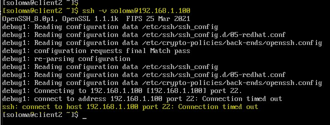

# Module – Linux Networking: Creation means Virtual Box network.

## Task 1: Configure static IP on *server1*
### Step 1: Edit netplan config file `/etc/netplan/*.yaml` as follows:
```
network:
  version: 2
  renderer: NetworkManager
  ethernets:
    enp0s3:
      addresses: [192.168.1.100/24]
      gateway4: 192.168.1.1
      dhcp4: no
      nameservers:
        addresses: [8.8.8.8, 8.8.4.4]
        search: [hometask.edu]
    enp0s8:
      addresses: [10.70.5.1/24]
#      gateway4: 10.7.5.1
      nameservers:
        addresses: [10.70.5.1]
        search: [hometask.edu]
    enp0s9:
      addresses: [10.11.70.1/24]
#      gateway4: 10.11.72.1
      nameservers:
        addresses: [10.11.70.1]
        search: [hometask.edu]
  
```
### Step 2: Then apply the configuration using the command: `sudo netplan apply`
Result - 3 network interfaces with IP addresses:
```
enp0s3: 192.168.0.100/24
enp0s8: 10.7.5.1/24
enp0s9: 10.11.70.1/24
```


## Task 2: Configure DHCP servise on *server1* which will configure Int1 addresses on *client1* and *client2*
### Step 1: Install DHCP server: `sudo apt install isc-dhcp-server`

### Step 2: Write network interface in config file `/etc/default/isc-dhcp-server`:
```
INTERFACESv4="enp0s8 enp0s9"
```

### Step 3: Uncomment and added these strings to `/etc/dhcp/dhcpd.conf`:
```
authoritative;

subnet 10.70.5.0 netmask 255.255.255.0 {
  range 10.70.5.10 10.70.5.50;
  option routers 10.70.5.1;
  option subnet-mask 255.255.255.0;
  option domain-name-servers 192.168.1.1, 8.8.8.8;
  option domain-name "hometask.edu";
}

subnet 10.11.70.0 netmask 255.255.255.0 {
  range 10.11.70.10 10.11.70.50;
  option routers 10.11.70.1;
  option subnet-mask 255.255.255.0;
  option domain-name-servers 192.168.1.1, 8.8.8.8;
  option domain-name "hometask.edu";
}
```

### Step 4: Restart DHCP service: `sudo systemctl restart isc-dhcp-server`


### Step 5: Enabled ip forwarding to provide tcp packets transport through **server1**:
`sudo sysctl -w net.ipv4.ip_forward=1`

### Step 6: Set up and check the network setting on host *client1*:
 #### a) Edit netplan config file `/etc/netplan/*.yaml`:
```
network:
  ethernets:
    enp0s3:
      dhcp4: true
    enp0s8:
      addresses: [172.16.5.1/24]
  version: 2
```
  #### b) Check the network setting:


### Step 7: Set up and check the network setting on host *client2*:
  #### a) Check netplan config file `/etc/sysconfig/network-scripts/ifcfg-enps3`:

 
  #### b) Edit netplan config file `/etc/sysconfig/network-scripts/ifcfg-enps8`:
```
BOOTPROTO=none
IPADDR0=172.16.5.2
PREFIX0=24
GATEWAY0=172.16.5.1
DNS1=8.8.8.8
```


### Step 8: Config *WiFi router* in home network:


## Task 3: Checking connection between hosts
`server1`:
### Step 1: Route on *client1*:


### Step 2: Route on *client2*:


### Step 3: Route on *inet*:


`client1`:
### Step 4: Route on *server*:


### Step 5: Route on *client2* :


### Step 6: Route on *inet*:


`client2`:
### Step 7: Route on *server*:


### Step 8: Route on *client1* :


### Step 9: Route on *Internet*:


## Task 4: Assignment of two IP addresses on the virtual interface *lo* *сlient1*
### Step 1: Definition IP Addr and run 2 commands on *client1*:
  #### a) +10 - `172.16.15.1/24`
    +20 - `172.16.25.1/24`
  #### b) `sudo ip addr add 172.16.15.1/24 dev lo label lo:10`
    `sudo ip addr add 172.16.25.1/24 dev lo label lo:20`


### Step 2: Add routes:
*client2*: `sudo ip route add 172.16.25.1/24 via 172.16.5.1`
*server1*: `sudo ip route add 172.16.15.1/24 via 10.70.5.10`

### Step 3: Trace IP Addresses:


## Task 5: Summarizing
### Step 1: Convert network addresses to binary system:
```
172.16.15.0 = 10101100.00010000.00001111.00000000
172.16.25.0 = 10101100.00010000.00011001.00000000
```

### Step 2: Shared address and mask:
```
Shared address = 10101100.00010000.000 | 00000.00000000
          Mask = 11111111.11111111.11100000.00000000
```

### Step 3: IP Addr in decimal:
```
172.16.0.0 / 19
255.255.224.0

```
### Step 4: Check route with summarizing network:
  #### a) Add route on *server1*: `sudo ip route add 172.16.0.0/19 via 10.11.70.10`
  #### b) Del (add on t4s2) route on *server1*: `sudo ip route del 172.16.15.0/24 via 10.11.70.10`
  #### c) Del (add on t4s2) route on *client2*: `sudo ip route del 172.16.25.1/24 via 172.16.5.1`
  #### d) Check route:


## Task 6: SSH service configuration
### Step 1: Install and check SSH service on *server1*:
  #### a) `sudo apt install openssh-server`
  #### b) `systemctl status ssh`


### Step 2: SSH keygen and copy open keys on *server1* for hosts *client1* and *client2*:
  For *client1*
  #### a) `ssh-keygen` 
  #### b) `ssh-copy-id -i ./.ssh/id_rsa.pub soloma@192.168.1.100`
  #### c) `ssh soloma70@192.168.1.100`

  #### d) For *client2* to repeat p.p. a - c

  
  #### e) File content `authorized_keys` on *server1*


### Step 3: Сonnecting hosts *client1* and *client2* to each other without SSH keys:


## Task 7: Configuration on *server1* firewall
### Step 1: Add rules on *server1*:
`sudo iptables -A INPUT -i enp0s9 -p tcp --dport 22 -j DROP`
`sudo iptables -A FORWARD -p icmp -d 172.16.25.1 -j DROP`


### Step 2: SSH connection with *server1*:
  #### a) From *client1*

  #### b) From *client2*

  #### c) ping on 172.16.15.1 and 172.16.25.1 from *client2*


## Task 8: Configuration on *server1* NAT
### Step 1: Deletion of established (t2s8) WiFi router settings:


### Step 2: Add rule on *server1*:
`sudo iptables -t nat -A POSTROUTING -j MASQUERADE`


### Step 3: Check connect to *Internet*:


