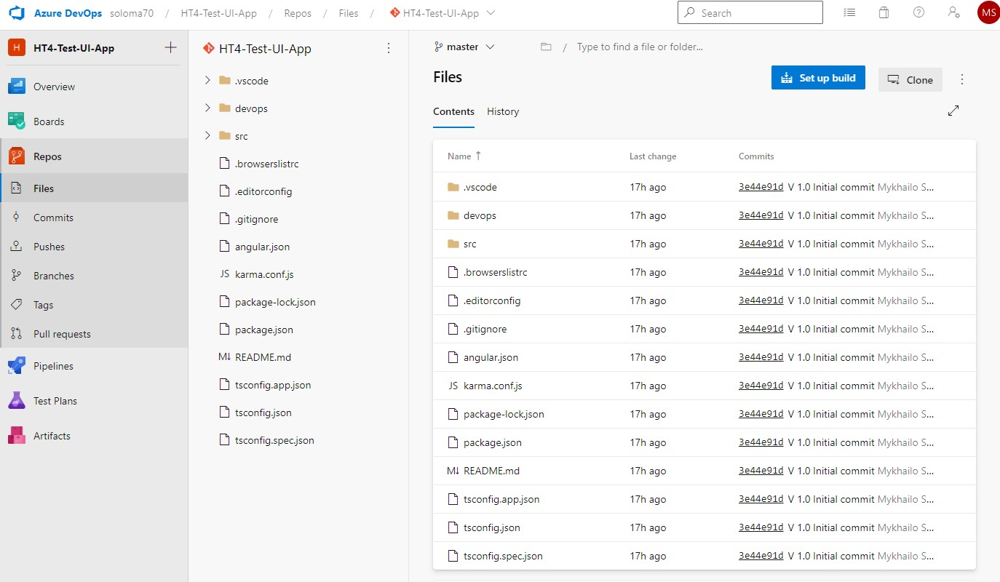
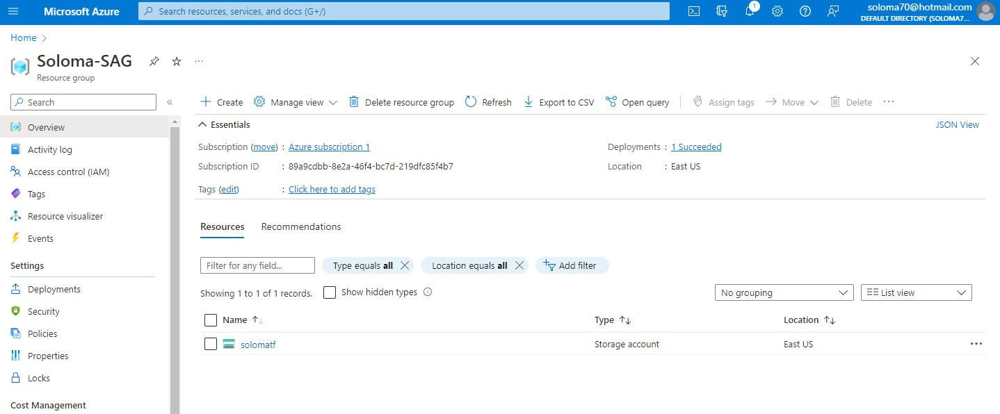
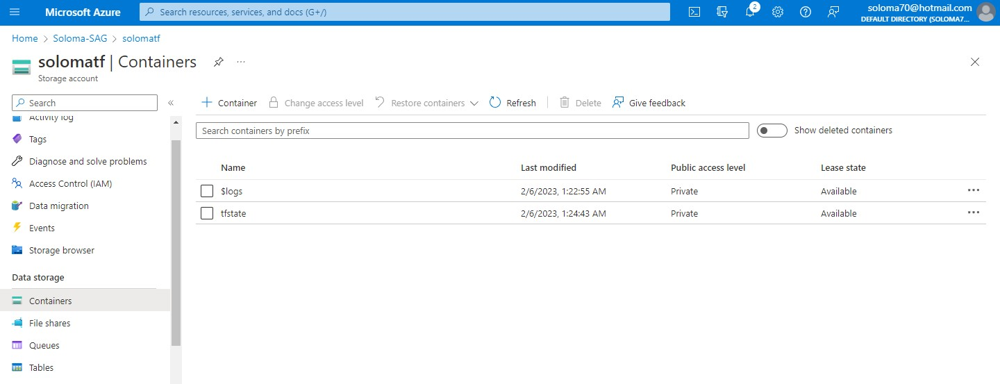
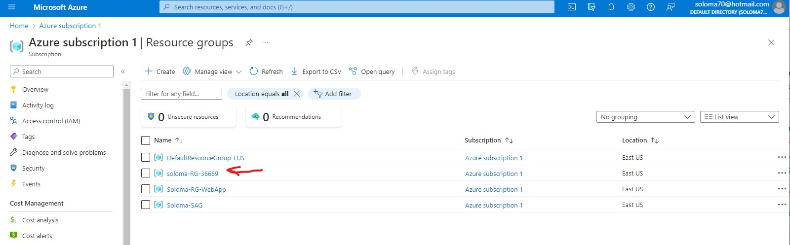

# Azure Cloud. Home task.

## Part 1. Configure application.
### Step 1. Create a service connection in a Azure DevOps project to your subscription.


### Step 2. Build your app locally .net project via dotnet tool. dotnet restore/build/run.
```
~/Azure/$ mkdir test-ui-ap
~/Azure/$ cd test-ui-ap
~/Azure/test-ui-app$ git init
~/Azure/test-ui-app$ git clone https://github.com/soloma70/test-ui-app.git
soloma@HT-Server1:~/Azure/test-ui-app$ ll
total 844
drwxrwxr-x 6 soloma soloma   4096 лют  4 18:00 ./
drwxrwxr-x 3 soloma soloma   4096 лют  4 18:00 ../
-rw-rw-r-- 1 soloma soloma   3185 лют  4 18:00 angular.json
-rw-rw-r-- 1 soloma soloma    600 лют  4 18:00 .browserslistrc
drwxrwxr-x 2 soloma soloma   4096 лют  4 18:00 devops/
-rw-rw-r-- 1 soloma soloma    274 лют  4 18:00 .editorconfig
drwxrwxr-x 8 soloma soloma   4096 лют  4 18:29 .git/
-rw-rw-r-- 1 soloma soloma    548 лют  4 18:00 .gitignore
-rw-rw-r-- 1 soloma soloma   1433 лют  4 18:00 karma.conf.js
-rw-rw-r-- 1 soloma soloma   1099 лют  4 18:00 package.json
-rw-rw-r-- 1 soloma soloma 797779 лют  4 18:00 package-lock.json
-rw-rw-r-- 1 soloma soloma   1397 лют  4 18:00 README.md
drwxrwxr-x 5 soloma soloma   4096 лют  4 18:00 src/
-rw-rw-r-- 1 soloma soloma    287 лют  4 18:00 tsconfig.app.json
-rw-rw-r-- 1 soloma soloma    863 лют  4 18:00 tsconfig.json
-rw-rw-r-- 1 soloma soloma    333 лют  4 18:00 tsconfig.spec.json
drwxrwxr-x 2 soloma soloma   4096 лют  4 18:00 .vscode/
soloma@HT-Server1:~/Azure/test-ui-app$  npm install
added 922 packages, and audited 923 packages in 36s
121 packages are looking for funding
  run `npm fund` for details
6 vulnerabilities (2 moderate, 4 high)
To address all issues, run:
  npm audit fix
Run `npm audit` for details.
npm notice
npm notice New minor version of npm available! 9.3.1 -> 9.4.1
npm notice Changelog: https://github.com/npm/cli/releases/tag/v9.4.1
npm notice Run npm install -g npm@9.4.1 to update!
npm notice
soloma@HT-Server1:~/Azure/test-ui-app$ npm run build
> test-application@0.0.0 build
> ng build
✔ Browser application bundle generation complete.
✔ Copying assets complete.
✔ Index html generation complete.
Initial Chunk Files           | Names         |  Raw Size | Estimated Transfer Size
main.3dc37b7c2b0f0ac5.js      | main          | 310.71 kB |                93.30 kB
polyfills.3313b6a5f1f122f9.js | polyfills     |  33.08 kB |                10.65 kB
runtime.fecd07c37cf1ffb9.js   | runtime       |   1.06 kB |               601 bytes
styles.ef46db3751d8e999.css   | styles        |   0 bytes |                       -
                              | Initial Total | 344.85 kB |               104.54 kB
Build at: 2023-02-04T16:34:50.466Z - Hash: 044fba57181e8347 - Time: 37414ms
soloma@HT-Server1:~/Azure/test-ui-app$ npm start
> test-application@0.0.0 start
> ng serve
✔ Browser application bundle generation complete.
Initial Chunk Files   | Names         |  Raw Size
vendor.js             | vendor        |   3.07 MB |
polyfills.js          | polyfills     | 318.02 kB |
styles.css, styles.js | styles        | 210.56 kB |
main.js               | main          |  52.35 kB |
runtime.js            | runtime       |   6.53 kB |
                      | Initial Total |   3.64 MB
Build at: 2023-02-04T16:36:24.724Z - Hash: 349930a376598739 - Time: 21319ms
** Angular Live Development Server is listening on localhost:4200, open your browser on http://localhost:4200/ **

✔ Compiled successfully.
```
./screenshots/Azure_p1s2.jpg)

### Step 3. Create an Azure DevOps repo.


### Step 4. Create a branching policy for you application. Added yourself as a reviewer.
./screenshots/Azure_p1s4.jpg)

## Part 2. Configure a pipeline to deploy infrastructure.
### Step 1. Create service connection – manual way.


### Step 3. Create a separate resource group and deploy azure storage account.


### Step 4. Create a container with the name “tfstate” and remember the name. Use portal settings.


### Step 5. Create another repo to store devops code.


### Step 6. Install Azur CLI and create a folder terraform. 
```
~$ curl -sL https://aka.ms/InstallAzureCLIDeb | sudo bash
~$ mrdir terraform && cd terraform
~/terraform$ mkdir tf_app_serv && cd tf_app_serv
~/terraform/tf_app_serv$ nano create-app-serv.tf
```
<https://github.com/soloma70/HomeTasks_L1/tree/master/5_Azure/terraform/create-app-serv.tf>

### Step 7. Add app service implementation.
```
~/terraform/tf_app_serv$ terraform init 
~/terraform/tf_app_serv$ terraform apply 
...
Apply complete! Resources: 4 added, 0 changed, 0 destroyed.
```



### Step 8. Integrate application insights with app service.


### Step 9. Updated backend “azurerm” according to the guide.
```
~/terraform/tf_app_serv$ cd ..
~/terraform$ mkdir tf_rssa && cd tf_rssa
~/terraform/tf_rssa$ nano create-remote-storage.tf
```
<https://github.com/soloma70/HomeTasks_L1/tree/master/5_Azure/terraform/create-remote-storage.tf>
```
~/terraform/tf_rssa$ terraform init 
~/terraform/tf_rssa$ terraform apply 
...
Apply complete! Resources: 4 added, 0 changed, 0 destroyed.
```


### Step 10. Run az login or Connect-AzAccount to connect the azure subscription from your local.
```
~$ az login
A web browser has been opened at https://login.microsoftonline.com/organizations/oauth2/v2.0/authorize. Please continue the login in the web browser. If no web browser is available or if the web browser fails to open, use device code flow with `az login --use-device-code`.
[
  {
    "cloudName": "AzureCloud",
    "homeTenantId": "xxxxx-xxxx-xxxxx-xxxx-xxxxx",
    "id": "xxxxx-xxxx-xxxxx-xxxx-xxxxx",
    "isDefault": true,
    "managedByTenants": [],
    "name": "Azure Soloma HT4",
    "state": "Enabled",
    "tenantId": "xxxxx-xxxx-xxxxx-xxxx-xxxxx",
    "user": {
      "name": "soloma70@hotmail.com",
      "type": "user"
    }
  }
]
~$ az account set --subscription "xxxxx-xxxx-xxxxx-xxxx-xxxxx"
~$ az ad sp create-for-rbac --role="Contributor" --scopes="/subscriptions/xxxxx-xxxx-xxxxx-xxxx-xxxxx"
Creating 'Contributor' role assignment under scope '/subscriptions/89a9cdbb-8e2a-46f4-bc7d-219dfc85f4b7'
The output includes credentials that you must protect. Be sure that you do not include these credentials in your code or check the credentials into your source control. For more information, see https://aka.ms/azadsp-cli
{
  "appId": "xxxxxx-xxx-xxxx-xxxx-xxxxxxxxxx",
  "displayName": "azure-cli-2023--xxxx",
  "password": "xxxxxx~xxxxxx~xxxxx",
  "tenant": "xxxxx-xxxx-xxxxx-xxxx-xxxxx"
}
~$ export ARM_CLIENT_ID="<APPID_VALUE>"
~$ export ARM_CLIENT_SECRET="<PASSWORD_VALUE>"
~$ export ARM_SUBSCRIPTION_ID="<SUBSCRIPTION_ID>"
~$ export ARM_TENANT_ID="<TENANT_VALUE>"
~$ export RESOURCE_GROUP_NAME="tfstate"
~$ export STORAGE_ACCOUNT_NAME="tfstate7exqe"
~$ ACCOUNT_KEY=$(az storage account keys list --resource-group $RESOURCE_GROUP_NAME --account-name $STORAGE_ACCOUNT_NAME --query '[0].value' -o tsv)
~$ export ARM_ACCESS_KEY=$ACCOUNT_KEY
~$ 
```

### Step 11. Run terraform apply to deploy infrastructure.
```
~$ cd terraform/
~/terraform$ mkdir tf_bend && cd tf_bend
~/terraform/tf_bend$ nano backend.tf
```
<https://github.com/soloma70/HomeTasks_L1/tree/master/5_Azure/terraform/backend.tf>
```
~/terraform/tf_bend$ terraform init 
~/terraform/tf_bend$ terraform apply
...
Apply complete! Resources: 1 added, 0 changed, 0 destroyed.
```


### Step 12. Create a yaml pipeline with the following steps: terraform install, terraform init, terraform plan/apply.


### Step 13. Inside yaml pipeline add trigger to main branch. The scenario – when main is updated, pipeline should run automatically


### Step 14. Added 3 steps – terraform install, terraform init, terraform plan/apply. Plan is an optional one. You may add it as 4th step
<https://github.com/soloma70/HomeTasks_L1/tree/master/5_Azure/devops/tf-pipeline-deploy.yml>

## Part 3. Create a deploy pipeline to app service.
### Step 1. Add yml pipeline to the application folder.

### Step 2. Your pipeline structure should contain 2 stages. 1st – build, create zip archieve, and publish an artifact. 2nd – download an artifact and deploy it to azure app service.

### Step 3. To deploy .zip to app service use azure app service deployment task.

<https://github.com/soloma70/HomeTasks_L1/tree/master/5_Azure/devops/app-pipeline-deploy.yml>

